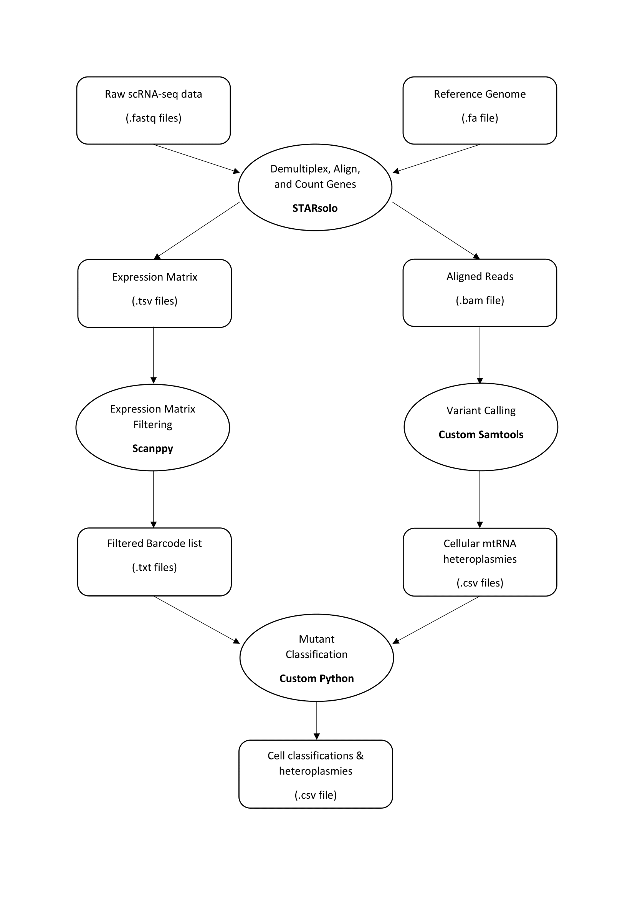

# Mito-Ageing

Bioinformatics pipeline for obtaining heteroplasmy features from scRNA-seq raw data. The pipeline goes from raw .fastq files and outputs standard features of a single cell workflow including aligned .bam files and expression matrices. As well as this, the heteroplasmy of mutations observed in single cells is output as a csv file which is then used for further analysis.

This code accompanies the manuscript "Cryptic mitochondrial ageing takes a lifetime and is pathophysiologically informative in single cells across tissues and species" by Alistair Green, Florian Klimm, Aidan S. Marshall, Juvid Aryaman, Patrick F. Chinnery, and Nick S. Jones.

## Prerequisites
- [STAR](https://github.com/alexdobin/STAR) for the alignment of the reads
- PySAM for variant calling
- scanpy for the gene-expression matrix analysis

## Pipeline Workflow

### How-to

This project consist of four steps
1. Processing of raw sequencing reads
- Downloading the data from GEO or AWS
- Alignment of reads to reference genome with STAR
- Filtering out mitochondrial reads for variant calling
2. Characterisation of mitochondrial mutations at a single-cell level
- Quality control of mitochondrial mutation data
- Comparing mutations across the data set to identify `cryptic` mutations
3. Figure creating for analysis of mitochondrial mutations
- Comparison with pseudo-bulk heteroplasmy
- Computation of site-frequency spectrum
- Selection effects
- Increasing homoplasmies with age
- Increasing difference between SFS with increasing age difference of donors
4. Gene-expression analysis
- Quality control of gene-expresison matrix
- Incorporation of mitochondrial

### Data

Due to space limitations, we do not provide raw sequencing read data in this GitHub (but they can be downloaded from GEO and AWS). Rather, we provide preprocessed mutation data and gene-expression matrix for one example data for the human pancreas [link](https://pubmed.ncbi.nlm.nih.gov/28965763/) .

Raw sequencing data is publicly available for all data sets analysed in our manuscript:

| Link to paper | Accession number |
| ---      | ---              |
|    [Buenrostro et al., Nature, 2015](https://pubmed.ncbi.nlm.nih.gov/26083756/)          |  [GSE65360](https://www.ncbi.nlm.nih.gov/geo/query/acc.cgi?acc=GSE65360)      |
|    [Muraro et al., Cell Syst., 2016](https://pubmed.ncbi.nlm.nih.gov/27693023/)          |  [GSE85241](https://www.ncbi.nlm.nih.gov/geo/query/acc.cgi?acc=GSE85241)      |
|    [Enge et al., Cell, 2017](https://pubmed.ncbi.nlm.nih.gov/28965763/)          |  [GSE81547](https://www.ncbi.nlm.nih.gov/geo/query/acc.cgi?acc=GSE81547)      |
|    [Grubman et al., Nat Neurosci., 2019](https://pubmed.ncbi.nlm.nih.gov/31768052/)          |  [GSE138852](https://www.ncbi.nlm.nih.gov/geo/query/acc.cgi?acc=GSE138852)      |
|    [Voigt et al., PNAS, 2019](https://pubmed.ncbi.nlm.nih.gov/31712411/)          |  [GSE135922](https://www.ncbi.nlm.nih.gov/geo/query/acc.cgi?acc=GSE135922)      |
|    [Almanzar et al., Nature, 2020](https://www.nature.com/articles/s41586-020-2496-1)          |  [AWS](https://registry.opendata.aws/tabula-muris-senis/)      |
|    [Corces et al., Nat Genetics, 2020](https://www.nature.com/articles/s41588-020-00721-x)          |  [GSE147672](https://www.ncbi.nlm.nih.gov/geo/query/acc.cgi?acc=GSE147672)      |
|    [Ma et al., Cell, 2020](https://pubmed.ncbi.nlm.nih.gov/32109414/)          |  [GSE137869](https://www.ncbi.nlm.nih.gov/geo/query/acc.cgi?acc=GSE137869)      |
|    [Smaji et al., medRxiv, 2020](https://www.medrxiv.org/content/10.1101/2020.09.28.20202812v1)          |  [GSE157783](https://www.ncbi.nlm.nih.gov/geo/query/acc.cgi?acc=GSE157783)      |
